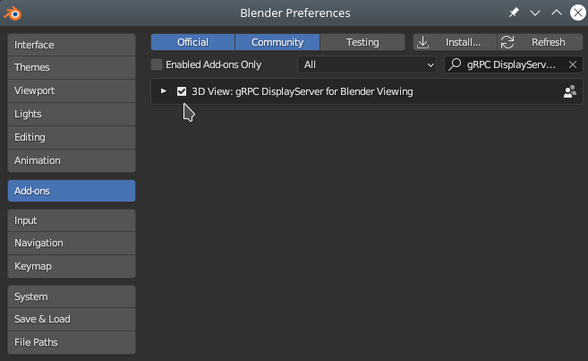

Welcome
-------
This is a repository with [Mastodon](https://github.com/mastodon-sc/mastodon) plugins
topically related to exporting the tracking data (lineage trees) **outside Mastodon** in the following ways:

- BigDataViewer window that keeps sending to [Blender](https://www.blender.org/) the currently displayed spots under their current view, [**demo video**](https://www.fi.muni.cz/~xulman/files/Mastodon/Blender_ng/demo_videos/MastodonBlender-demo-onlineBDV.webm) (*find it here: Mastodon->Plugins->Auxiliary Displays->BDV Spots To Blender*),

- sends to [Blender](https://www.blender.org/) the full lineage data with all tracks spots decimated into one graph vertex as in Mastodon->Window->New TrackScheme Hierarchy, [**demo video**](https://www.fi.muni.cz/~xulman/files/Mastodon/Blender_ng/demo_videos/MastodonBlender-demo-fullLineages.webm) (*find it here: Mastodon->Plugins->Auxiliary Displays->All Spots To Blender*),

- sends to Blender the full lineage data with all tracks spots decimated into one graph vertex as in Mastodon->Window->New TrackScheme Hierarchy, and additionally visualized as if projected onto a cylinder, which got unfolded, [**demo picture**](doc/MastodonBlender_flatView.png) (*find it here: Mastodon->Plugins->Auxiliary Displays->Flat View*),

- sends out the lineage tree(s) from all-available or selected-only spots (*find it here: Mastodon->Plugins->Auxiliary Displays->Lineage Exports*).

The latter variant offers several additional options, such as uploading
- with straight lines (showing mother-daughter relation ship) between such vertices,
- or with rectangularly bended lines,
- with various left-to-right display order of daughters,
- and into various sinks, e.g.,
  - as `.graphml` file for [yEd](https://www.yworks.com/products/yed),
  - in a separate window rendered with [GraphStream](https://graphstream-project.org/),
  - in a separate applications such as [Blender](https://www.blender.org/) or [sciview](https://imagej.net/plugins/sciview).

It was developed and is maintained by [Vladimír Ulman](http://www.fi.muni.cz/~xulman/),
based on our previous work [The BioMatch Blender addon](https://www.fi.muni.cz/~xulman/files/Mastodon/Blender/),
together with Petr Strakoš from [IT4Innovation](https://www.it4i.cz/en).

:green_circle::green_circle:   Currently this is a brand new overhaul,
more powerful and flexible too, I think... ;-).   :green_circle::green_circle:

License
--------
All here is licensed with the [BSD 2-Clause License](https://choosealicense.com/licenses/bsd-2-clause/).

Install by enabling respective Fiji update sites, and then setup your Blender installation
------------------------------------------------------------------------------------------
## Fiji
1. Open [Fiji](https://fiji.sc/)
1. Click menus: 'Help' -> 'Update...'
1. Click 'Manage update sites' in the opened 'ImageJ Updater' dialog
1. Mark the **Mastodon** and **TomancakLab** checkboxes
1. Click 'Close' to close the dialog, click 'Apply changes' to install everything

#### Notes
Once installed, one can find the tools in the Mastodon, in the _Plugins->Auxiliary Displays_ menu. 
Contact (ulman při fi.muni.cz) for help on how to use it.

## Blender
Blender is the foremost expected instance of *outside* where we wish to display
Mastodon content, and we need it to be at least **version 3.x series**.
Blender runs a [**dedicated addon**](https://github.com/xulman/graphics-net-transfers/raw/master/display_server_initial_Blender_project/display_server_addon.zip)
that listens for [*drawing commands*](https://github.com/xulman/graphics-net-transfers)
(expressed in [*own language/protocol*](https://github.com/xulman/graphics-net-transfers/blob/master/protocol_specification/buckets_with_graphics.proto))
using which Mastodon commands Blender what to display.
Also a [**dedicated project .blend file**](https://github.com/xulman/graphics-net-transfers/raw/master/display_server_initial_Blender_project/display_server_project.blend)
needs to be opened. Mastodon reaches Blender always via a network connection
(using [grpc](https://grpc.io/)), which can mean that both run on the very
same single host machine, or each on a different one.

To have the Mastodon--Blender connection functional, one needs to install

1. grpc library into Blender,
1. [Our DisplayServerService addon](https://github.com/xulman/graphics-net-transfers/raw/master/display_server_initial_Blender_project/display_server_addon.zip) to Blender, 
1. and open [a special Blender project](https://github.com/xulman/graphics-net-transfers/raw/master/display_server_initial_Blender_project/display_server_project.blend).

#### Step 1.
Blender setup can be realized comfortably using Mastodon:

1. Open Fiji, open Mastodon, open some project in Mastodon
1. Click 'Plugins', choose 'Setup Blender Addon ...'
1. Dialog comes out. Please, follow it... (maybe you want to select "All Files" in the "Files of Type" dropdown box)

Here's how to add grpc *manually* into your installed Blender, **required version is 3.x** series:

1. Stop & close Blender
1. Open a terminal (konsole)
1. `cd` into where you have dropped the Blender.app
1. Further `cd` deep into it:
	1. on mac: `cd Blender.app/Contents/Resources/3.4/python/bin`
	1. on linux: `cd blender-3.4.1-linux-x64/3.4/python/bin`
	1. on windows: ...similarily...
1. Run the following commands (one full line, one command, the same on all OSes):
	1. `./python3.10 -m ensurepip`
	1. `./python3.10 -m pip install --upgrade pip`
	1. `./pip install grpcio-tools`

Now, Blender is equipped and "talk grpc".

#### Step 2.
We have to install the
[addon](https://github.com/xulman/graphics-net-transfers/raw/master/display_server_initial_Blender_project/display_server_addon.zip)
to Blender:
1. Open Blender (the one that you potentially pointed Mastodon to)
1. Click menus 'Edit', then 'Preferences...'
1. Choose 'Add-ons' in the left bar of the window that popped out
1. Top-right choose 'Install...' and point it on the downloaded 'display_server_addon.zip'
1. Should show '3D View: gRPC DisplayServer for Blender Viewing', make sure **it is ticked**
1. Close the 'Blender Preferences' window now

By now, the Blender DisplayServer should be running and listening on **port 9083**.

#### Step 3.
Finally, it remains to **open the special .blend project**,
which you can [download here](https://github.com/xulman/graphics-net-transfers/raw/master/display_server_initial_Blender_project/display_server_project.blend). 
**Make sure you are looking at timepoint 0 in Blender...**

## sciview
*This is obsolete and not maintained, perhaps already not even available in the current
form of this repo.... but certainly possible to restore if somebody asks for it.*

This particular form of *outside* was also implemented via the network connection.
The client code is implemented here, in the commit history of this repo.
The server side is implemented in [the allied other repository](https://github.com/mastodon-sc/mastodon-sciview).
